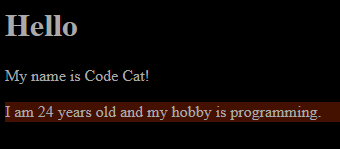

# a.app.js

Javascript application framework like Vue, but.. different. Just a hobby project, probably won't be developed for a very long time.

## Example



```html
<h1>Hello</h1>
<p>My name is {{ first_name + " " + last_name }}!</p>
<p style="background: {{ bg_color }};">I am {{ person.age }} years old and my hobby is {{ person.hobby }}.</p>
```

```js
class TestApp extends App
{
	constructor()
	{
		super({
			first_name: "Nobody",
			last_name: "Person",
			bg_color: "#410",
			person: {
				age: 12,
				hobby: "nothing"
			}
		});
	}
}

var app = new TestApp();

app.data.last_name = "Cat";
app.data.first_name = "Code";

app.data.person.hobby = "programming";
app.data.person.age = 24;

setInterval(function() {
	app.data.person.age++;

	if (app.data.bg_color == "#410") {
		app.data.bg_color = "#014";
	} else {
		app.data.bg_color = "#410";
	}

	if (app.data.person.age > 70) {
		app.data.person.hobby = "probably not programming anymore";
	}
}, 1000);
```
